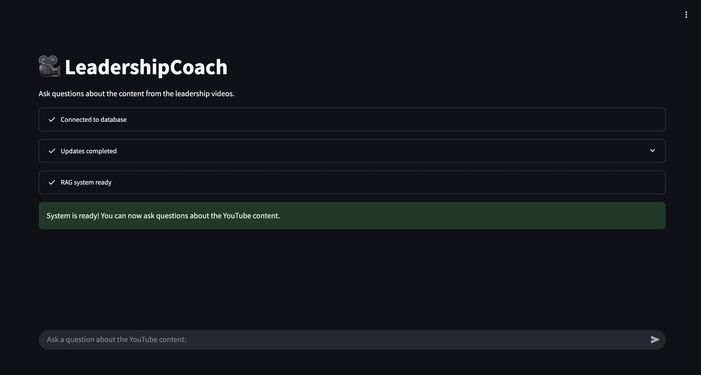
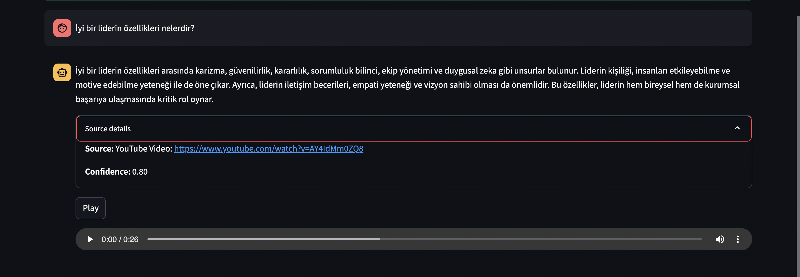
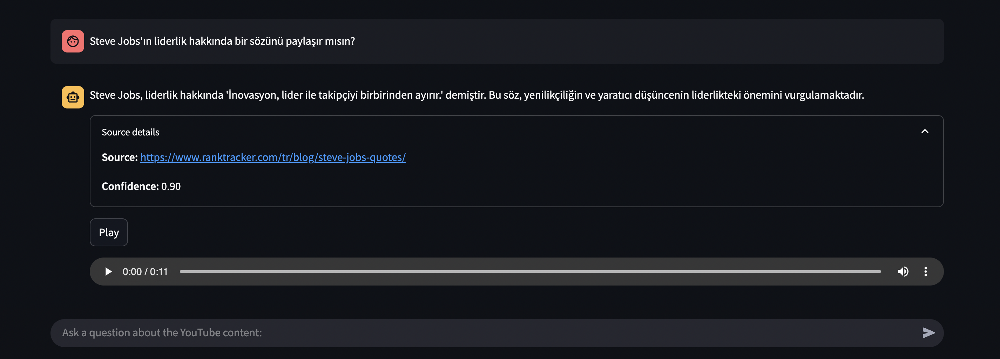

# YouTube RAG Assistant

A Retrieval-Augmented Generation (RAG) application for processing YouTube content, enabling conversational question-answering with speech-to-text and text-to-speech capabilities.

 

## Purpose and Scope

This application automates the extraction of knowledge from YouTube videos through:
1. Downloading audio from specified YouTube playlists
2. Transcribing speech to text using Whisper
3. Processing and indexing the transcribed content in a vector database
4. Providing a conversational interface to query the content
5. Supporting multilingual responses with text-to-speech functionality

The current implementation focuses on a specific leadership-oriented YouTube playlist from BloombergHT (in Turkish), but can be adapted to any YouTube content by modifying the playlist URL.

## Project Structure

```
youtube-rag-assistant/
├── src/
├────── agent_state.py        # State definitions for the RAG workflow
├────── rag_graph.py          # LangGraph workflow implementation
├────── tools.py              # External tools (web search, TTS)
├────── utils/
├────────── create_vectordb.py    # Vector database operations
├────────── elevenlabs_wrapper.py # Text-to-speech integration
├────────── get_transcriptions.py # YouTube download and transcription
├────────── prompts.py            # LLM prompt templates
├── docker-compose.yaml   # Docker configuration for Weaviate
├── Dockerfile            # Docker configuration for RAG App
├── start.sh              # Startup script for the Docker container
├── main.py               # Main application and Streamlit UI
├── requirements.txt      # Project dependencies
├── .env                  # Environment variables (not in repo)
├── .env.template         # Template for environment variables
├── audio_files/          # Downloaded audio files (generated)
├── transcripts/          # Transcribed text files (generated)
└── weaviate-data/        # Vector database data (generated)
```

## Services, Libraries, and Tools

### Core Infrastructure
- **Streamlit**: Web interface for the application
- **Docker**: Containerization for the Weaviate database
- **Weaviate**: Vector database for semantic search

### Language Models & Embeddings
- **OpenAI GPT-4o**: Powers the conversational assistant
- **HuggingFace**: Provides the embedding model for semantic search: "BAAI/bge-m3"
- **Whisper**: OpenAI's speech-to-text model for transcription

### RAG Components
- **LangChain**: Framework for building LLM applications
- **LangGraph**: Graph-based workflows for complex agent interactions
- **DuckDuckGo Search**: Web search for supplementary information

### Media Processing
- **PyTubeFix**: Library for downloading YouTube videos
- **ElevenLabs**: Text-to-speech conversion for audio responses

## Script Explanations

- **get_transcriptions.py**: Downloads YouTube videos, transcribes audio, and processes transcripts into chunks.
- **create_vectordb.py**: Manages all vector database operations with Weaviate.
- **agent_state.py**: Defines data models and state types for the LangGraph workflow.
- **prompts.py**: Contains prompt templates for context analysis and answer generation.
- **tools.py**: Implements external tools including web search and text-to-speech.
- **rag_graph.py**: Implements the RAG system with LangGraph for processing queries.
- **main.py**: Orchestrates the application and provides the Streamlit user interface.

## Screenshots

### Main Interface
 

### Chat Interaction Example - From YouTube Content
 

### Chat Interaction Example - WebSearch
 

### Environment Variables

Create a `.env` file in the project root based on the `.env.template`:

```bash
# Required API Keys
OPENAI_API_KEY=your_openai_api_key
HF_SERVERLESS_INFERENCE_TOKEN=your_huggingface_api_key
ELEVENLABS_API_KEY=your_elevenlabs_api_key

# YouTube Configuration
YOUTUBE_PLAYLIST_URL=https://www.youtube.com/playlist?list=PLCi3Q_-uGtdlCsFXHLDDHBSLyq4BkQ6gZ

# Optional Configuration
# WHISPER_MODEL=base  # Options: tiny, base, small, medium, large
# LANGUAGE_CODE=tr    # Language code for transcription (default: tr for Turkish)
```

#### API Key Details

1. **OpenAI API Key**:
   - Sign up at [OpenAI](https://platform.openai.com/signup)
   - Create an API key in your account dashboard
   - Model used: GPT-4o (ensure your account has access)

2. **HuggingFace API Key**:
   - Create an account at [HuggingFace](https://huggingface.co/join)
   - Generate an access token in Settings > Access Tokens
   - Ensure the token has read access

3. **ElevenLabs API Key**:
   - Sign up at [ElevenLabs](https://elevenlabs.io/)
   - Get your API key from your profile settings
   - Free tier includes limited minutes of speech synthesis

### Local Installation

1. Clone the repository:
   ```bash
   git clone https://github.com/yourusername/youtube-rag-assistant.git
   cd youtube-rag-assistant
   ```

2. Create and activate a virtual environment:
   ```bash
   # On macOS/Linux
   python -m venv venv
   source venv/bin/activate
   
   # On Windows
   python -m venv venv
   venv\Scripts\activate
   ```

3. Install dependencies:
   ```bash
   pip install -r requirements.txt
   ```

4. Start the Weaviate vector database:
   ```bash
   docker-compose up -d weaviate
   ```

5. Run the Streamlit application:
   ```bash
   streamlit run main.py
   ```

6. Access the application in your browser at `http://localhost:8501`

### Docker Installation (Recommended)

For the most consistent experience, deploy both Weaviate and the RAG application using Docker:

1. Clone the repository:
   ```bash
   git clone https://github.com/yourusername/youtube-rag-assistant.git
   cd youtube-rag-assistant
   ```

2. Create the `.env` file as described above.

3. Build and start the containers:
   ```bash
   docker-compose up -d
   ```

4. Access the application in your browser at `http://localhost:8501`

## Running the Application

### First-Time Setup

On the first run, the application will:

1. Connect to the Weaviate database
2. Download audio from videos in the configured YouTube playlist
3. Transcribe the audio using Whisper (this may take time)
4. Process transcripts into chunks
5. Create embeddings and store them in Weaviate
6. Set up the RAG system with the LangGraph workflow

This process might take 5-30 minutes depending on:
- The number of videos in the playlist
- The length of each video
- Your internet connection speed
- Your computer's processing power

Progress will be displayed in the Streamlit interface with status indicators.

### Subsequent Runs

On subsequent runs, the application will:
1. Check for new videos in the playlist
2. Process only new videos if found
3. Start up much faster using the existing database

### Usage

1. Wait for the "System is ready!" message to appear
2. Type your question in the chat input
3. The system will retrieve relevant information from transcripts
4. If needed, it will supplement with web search results
5. Click the "Play" button to hear the answer in audio format
6. Expand "Source details" to see the information source and confidence score

## Advanced Configuration

### Whisper Model Selection

You can change the Whisper model used for transcription by modifying the `model_name` parameter in `AudioTranscriber` initialization.

Available models:
- `tiny`: Fastest, least accurate (~1GB RAM)
- `base`: Good balance of speed and accuracy (~1GB RAM)
- `small`: Better accuracy, slower (~2GB RAM)
- `medium`: High accuracy, slower (~5GB RAM)
- `large`: Highest accuracy, slowest (~10GB RAM)

Example in `main.py`:
```python
self.transcriber = AudioTranscriber(model_name="base", transcripts_path="transcripts")
```

### Changing the YouTube Playlist

You can change the YouTube playlist in three ways:

1. **Environment Variable**:
   ```
   YOUTUBE_PLAYLIST_URL=https://www.youtube.com/playlist?list=YOUR_PLAYLIST_ID
   ```

2. **In docker-compose.yaml**:
   ```yaml
   environment:
     - YOUTUBE_PLAYLIST_URL=https://www.youtube.com/playlist?list=YOUR_PLAYLIST_ID
   ```

3. **In code** (if not set in environment):
   ```python
   # In main.py
   self.playlist_url = "https://www.youtube.com/playlist?list=YOUR_PLAYLIST_ID"
   ```

### Language Settings

To change the language for transcription, modify the `language` parameter in the `transcribe_audio` method call:

```python
# In _process_all or _check_and_update methods in main.py
transcript = self.transcriber.transcribe_audio(audio_file, language="en")
```

Language codes:
- `en`: English
- `tr`: Turkish
- `fr`: French
- `de`: German
- `es`: Spanish
- Other [ISO language codes](https://en.wikipedia.org/wiki/List_of_ISO_639-1_codes)

### Weaviate Configuration

The Weaviate database can be configured in `docker-compose.yaml`. Key settings:

```yaml
environment:
  # Disk usage thresholds
  DISK_USE_WARNING_PERCENTAGE: '90'
  DISK_USE_READONLY_PERCENTAGE: '95'
  
  # Performance settings
  LIMIT_RESOURCES: 'false'  # Set to true to limit memory/CPU
  DEFAULT_VECTORIZER_MODULE: 'text2vec-huggingface'
```

## Troubleshooting

### Connection Issues

If the RAG application can't connect to Weaviate:

1. Ensure Weaviate is running:
   ```bash
   docker-compose ps
   ```

2. Check if Weaviate is healthy:
   ```bash
   curl http://localhost:8080/v1/meta
   ```

3. Run the diagnostic script:
   ```bash
   python test_weaviate_connection.py
   ```

4. Check Docker network:
   ```bash
   docker network inspect app_rag-network
   ```

### Disk Space Issues

If you encounter disk space warnings:

1. Check current disk usage:
   ```bash
   df -h
   ```

2. Clean up docker resources:
   ```bash
   docker system prune
   ```

3. Increase the disk thresholds in `docker-compose.yaml`:
   ```yaml
   DISK_USE_WARNING_PERCENTAGE: '95'
   DISK_USE_READONLY_PERCENTAGE: '98'
   ```

### YouTube Download Issues

If video downloads fail:

1. Ensure the YouTube playlist is public
2. Check if PyTubeFix is up to date
3. Try downloading a single video first:
   ```python
   from pytubefix import YouTube
   yt = YouTube("https://www.youtube.com/watch?v=VIDEO_ID")
   print(yt.title)  # Should print the video title
   ```

### API Key Issues

If you get authentication errors:

1. Double-check your API keys in the `.env` file
2. Ensure the keys have the necessary permissions
3. Check if you've reached API rate limits or quotas

## License

[MIT License](LICENSE) <!-- Add your preferred license -->

---

**Note**: This project is for educational and research purposes. Ensure you comply with YouTube's Terms of Service when downloading content.